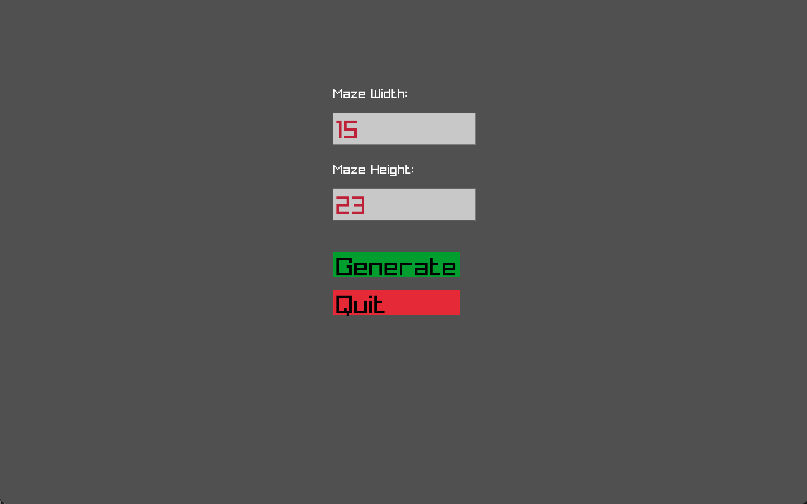
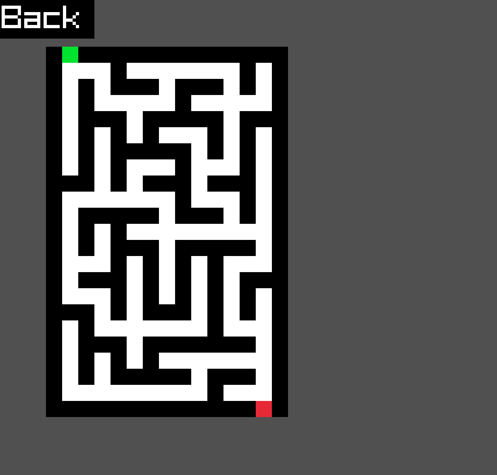

# DELTA MAZE
### About 
A simple maze generator using **Wilson's Algorithm**
Visualized with **Raylib**

## Features
- Generates perfect mazes with enterence at top left and exit at bottom right using Wilson's loop-ereased random walk algorithm
- Menu for customizing width & height
- Back button to reset and generate a new maze

### How To Use
Clone the repository
```
git clone https://github.com/peter34512800/DeltaMaze.git
cd DeltaMaze
```

To build, run the following command
```
make
```

To run, run the following command
```
./DeltaMaze
```

### Screenshots




### Upcoming Development
- [ ] Solver mode
- [ ] Generation Visualization mode